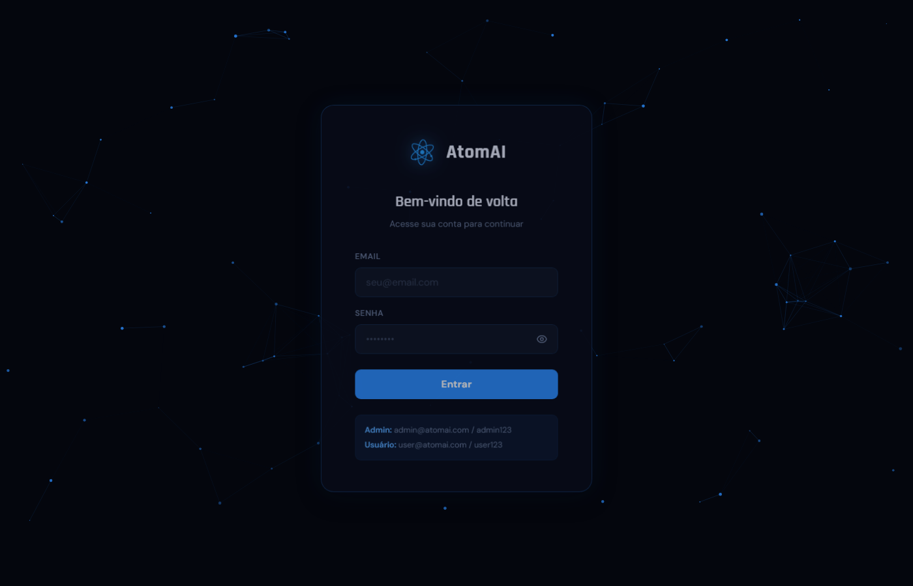
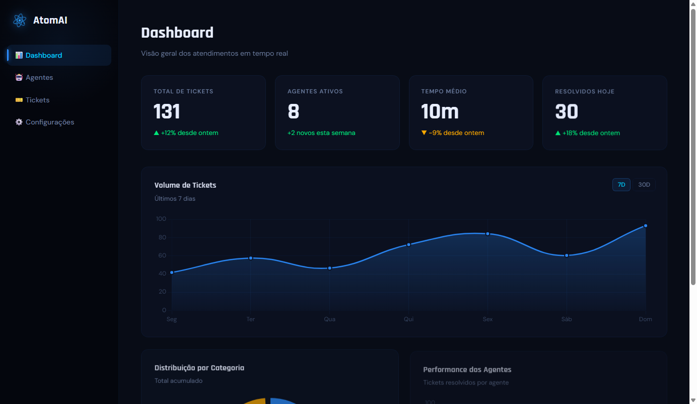
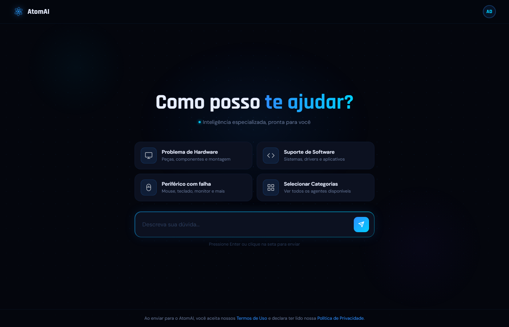

# AtomAI — Plataforma SaaS de Chatbots com IA Especializada

> Plataforma completa de atendimento via IA, com agentes especializados por nicho, painel administrativo, autenticação por função e integração com Gemini API.

---

## Demonstração

| Login | Dashboard |
|---|---|
|  |  |

<details>
<summary>Ver mais um print (chat landing)</summary>



</details>

| Tela | Descrição |
|---|---|
| Login | Autenticação com redirecionamento por função (admin / usuário) |
| Dashboard | Métricas em tempo real com Chart.js (linha, rosca, barras) |
| Chat Landing | Interface de seleção de tópico com sugestões rápidas |
| Chatbot | Conversa com IA via Gemini 2.5 Flash |
| Painel Admin | Gerenciamento de agentes, tickets e configurações |

**Credenciais de demonstração:**

| Perfil | E-mail | Senha |
|---|---|---|
| Admin | admin@atomai.com | admin123 |
| Usuário | user@atomai.com | user123 |

---

## Funcionalidades

### Autenticação & Controle de Acesso
- Login com validação de credenciais via `sessionStorage`
- Redirecionamento automático por função: admin → Dashboard, usuário → Chat
- Proteção de rotas via `js/auth.js` — usuários comuns não acessam páginas administrativas
- Botão "Painel Admin" oculto automaticamente para usuários comuns

### Dashboard Administrativo
- Contadores animados (tickets, agentes, resolução, satisfação)
- Gráfico de linha com período selecionável (7D / 30D) e gradiente dinâmico
- Gráfico de rosca por categoria de ticket (68% cutout)
- Gráfico de barras por agente com gradientes por barra
- Tabela de tickets recentes com status em tempo real

### Chat com IA
- Integração direta com **Gemini 2.5 Flash** (Google AI)
- Sugestões rápidas que pré-preenchem a conversa
- Seleção por categoria de problema (Hardware / Software / Periférico)
- Mensagens passadas entre páginas via `sessionStorage`
- Histórico visual no chat com avatares e timestamps

### Gerenciamento de Agentes
- Listagem de bots com métricas individuais
- Página de detalhe por agente com estatísticas e tickets recentes (`?id=B1/B2/B3`)

### Planos & Pagamento
- Página de planos com plano atual destacado visualmente
- Checkout visual completo (número de cartão, validade, CVC, preview do cartão em tempo real)
- Feedback de processamento animado

### Configurações & Perfil
- Salva nome, sobrenome, empresa e e-mail via `localStorage`
- Avatar com iniciais gerado automaticamente e sincronizado em todas as páginas
- Atualização em tempo real do avatar ao editar o nome

### Páginas Legais
- Termos de Uso com 11 seções e índice lateral fixo
- Política de Privacidade com conformidade LGPD, tabela de dados coletados e 8 direitos do titular

---

## Stack & Tecnologias

| Camada | Tecnologia |
|---|---|
| Frontend | HTML5, CSS3, JavaScript (ES6+) — sem framework |
| IA | Google Gemini 2.5 Flash API |
| Gráficos | Chart.js 4.4.3 |
| Fontes | Rajdhani + DM Sans (Google Fonts) |
| Armazenamento | `sessionStorage` (sessão) + `localStorage` (perfil) |
| Deploy | Estático — Vercel / Netlify / GitHub Pages |

---

## Estrutura do Projeto

```
ATOMAI/
├── html/
│   ├── index.html          # Login
│   ├── dashboard.html      # Painel admin com gráficos
│   ├── agentes.html        # Lista de agentes IA
│   ├── agente-detalhe.html # Detalhe individual do agente
│   ├── tickets.html        # Gerenciamento de tickets
│   ├── atomai-chat.html    # Chat landing (usuário)
│   ├── chatbot1.html       # Interface do chatbot com IA
│   ├── categorias.html     # Seleção de categoria
│   ├── planos.html         # Planos de assinatura
│   ├── pagamento.html      # Checkout visual
│   ├── conf.html           # Configurações do perfil
│   ├── termos.html         # Termos de Uso
│   └── privacidade.html    # Política de Privacidade
├── css/
│   ├── style.css           # Design system global (tokens, sidebar, cards)
│   ├── atomai-chat.css     # Chat landing
│   ├── bot1.css            # Interface do chatbot
│   └── categorias.css      # Página de categorias
├── js/
│   ├── auth.js             # Proteção de rotas por função
│   ├── bot1.js             # Lógica do chatbot + Gemini API
│   ├── sidebar.js          # Navegação e interações do painel
│   └── script.js           # Utilitários gerais
└── images/                 # Assets visuais
```

---

## Como Rodar Localmente

### Opção 1 — VS Code Live Server (recomendado)
1. Instale a extensão **Live Server** no VS Code
2. Clique em **Go Live** na barra inferior
3. Acesse `http://127.0.0.1:5500/html/index.html`

### Opção 2 — Python HTTP Server
```bash
python -m http.server 8000
# Acesse: http://localhost:8000/html/index.html
```

### Opção 3 — Node.js
```bash
npx serve .
# Acesse: http://localhost:3000/html/index.html
```

> **Importante:** o projeto usa caminhos absolutos (`/css/style.css`). Abrir os arquivos `.html` diretamente pelo explorador de arquivos não funciona — é necessário um servidor local.

---

## Configuração da API Gemini

1. Acesse [aistudio.google.com/app/apikey](https://aistudio.google.com/app/apikey)
2. Crie uma chave de API gratuita
3. Substitua em `js/bot1.js`:

```js
const API_KEY = 'SUA_GEMINI_API_KEY_AQUI';
```

---

## Design System

O projeto utiliza CSS custom properties compartilhadas:

```css
--bg-0: #04060d        /* fundo principal */
--accent: #2d8eff      /* azul primário */
--accent-bright: #00cfff /* azul ciano */
--text-1: #e8eeff      /* texto principal */
```

Fontes: **Rajdhani** (títulos) + **DM Sans** (corpo)

Componentes: glassmorphism, backdrop-blur, gradientes animados, partículas canvas, animações staggeradas.

---

## Autor

Desenvolvido por **Erick Dantas**

[](https://linkedin.com/in/seu-usuario)
[](https://github.com/seu-usuario)

---

*Projeto desenvolvido para fins de portfólio. As credenciais de login são fictícias e para demonstração.*
